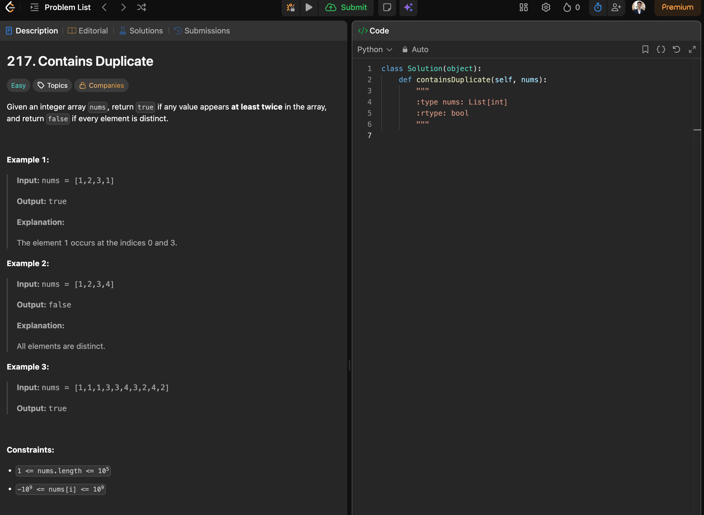

c

----l

Using the Nested For loop, we can solve this question but the time complexity would be O(n^2) as we are going to have more time as we are going on out list twice.

---

In order to check it only once.

One more solution to this would be lets say we can create an empty array.

We can check with that array and check if the element is present or not, if it is then we will add that element. Then, we will move to the next element and check the created array if the element exists, if it does not then we will add that array. We will do this until we have completed checking array. Now, we will compare the array, the old one and the newly created one. If they are same then we will retrun "False". If they are different, we will return "True"

Time cmplexity will remain O(n^2) becasue we are creating an extra array.

---
