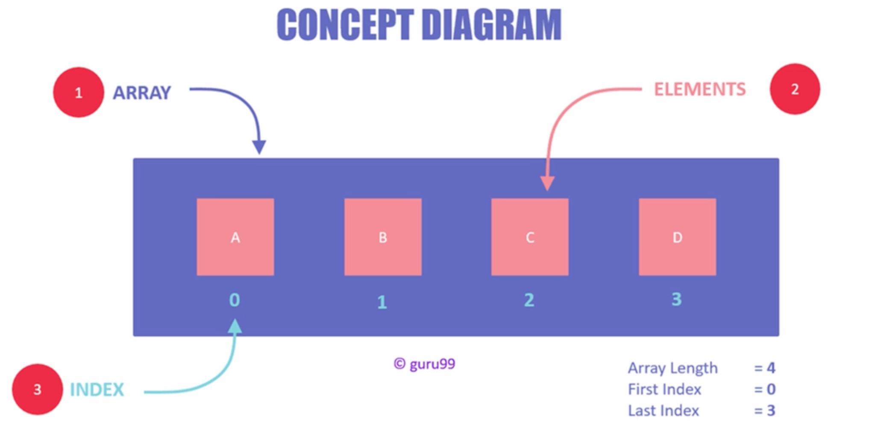
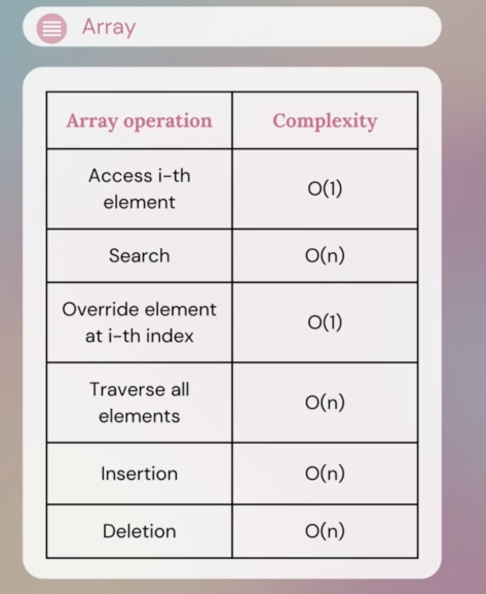

Arrays/Lists

What are the data structures I used in this topic?

Arrays/Lists, Hashsets/Sets, Hashmaps/Dictionary

---

Arrays and lists are nothing but collection of elements that are stored adjacent to each other. Each element has an index in order to access that value, which makes it easy to locate anything in an array or a list. Also to manipulate the data.

Have to frequently remove or add any elements. Arrays are not the best choice.

---
