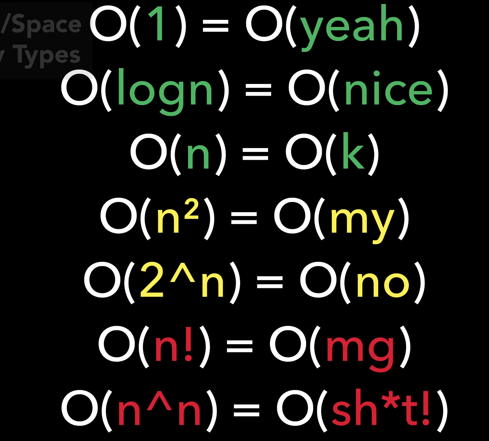
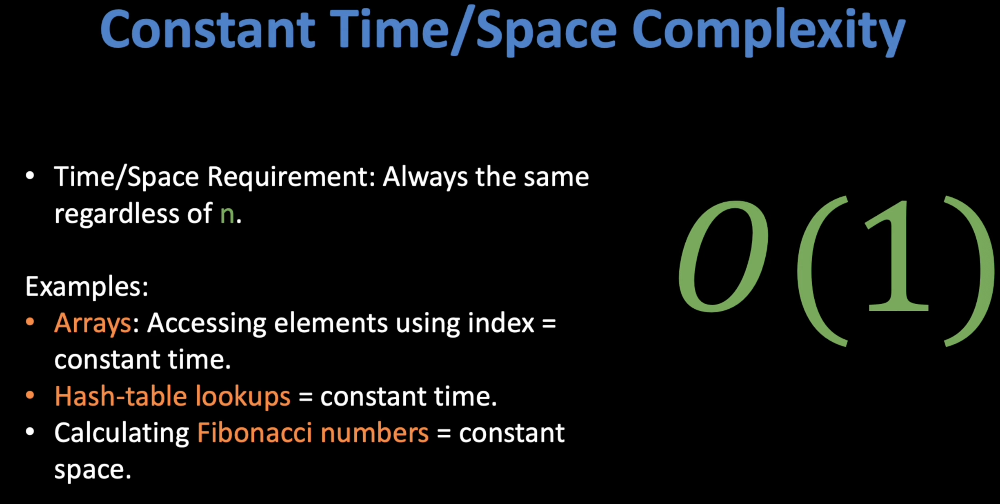
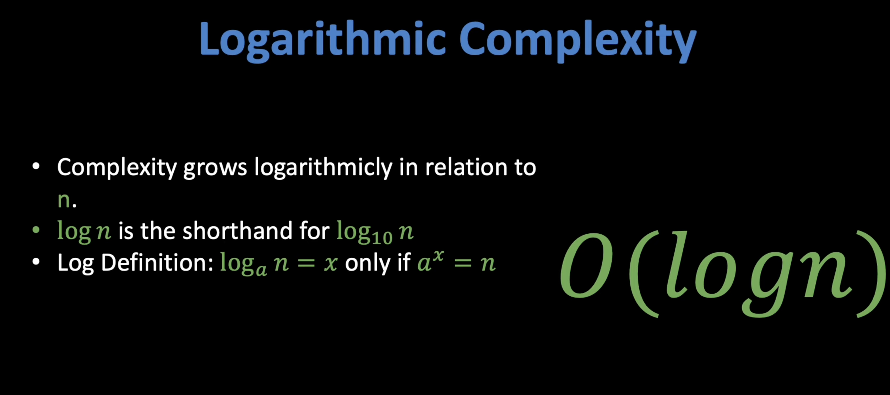
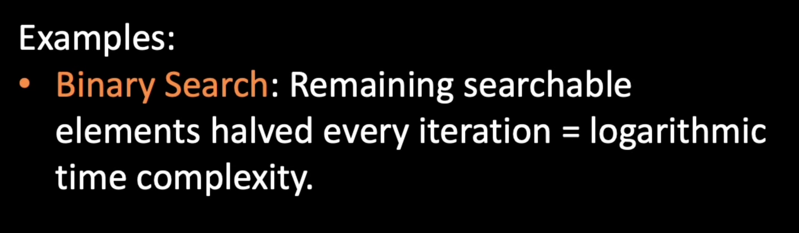
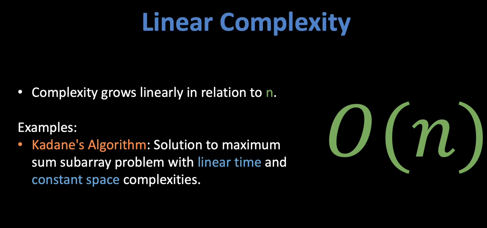
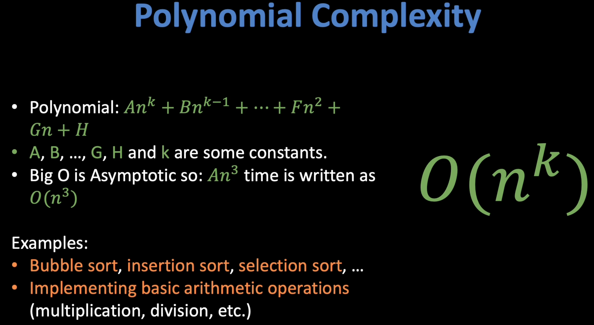
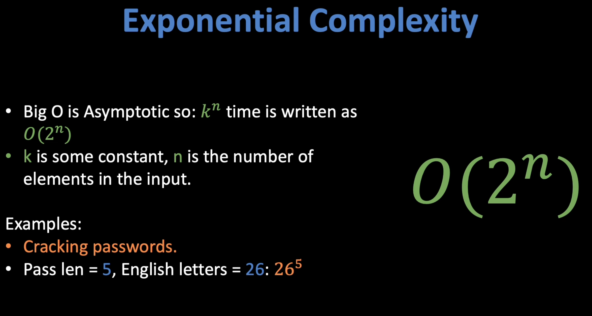
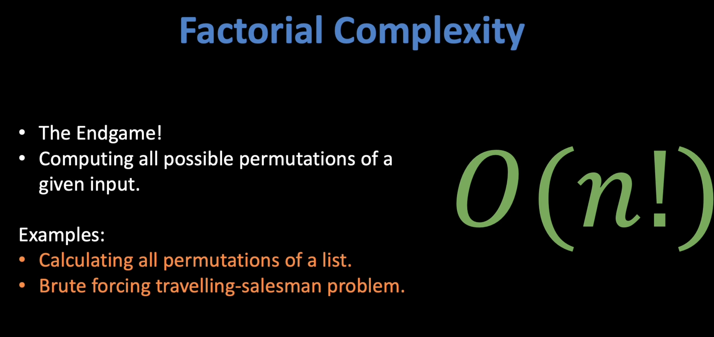

Link to learn about Time and complexity: 

[quanticdev.com/algorithms/primitives/big-o-time-space-complexity-types-explained](https://quanticdev.com/algorithms/primitives/big-o-time-space-complexity-types-explained/)

---


`Time and space complexities are a measure of a function’s processing power and memory requirements.`

`Many time/space complexity types have special names that you can use while communicating with others. While some of the names for complexity types are well known, like linear and constant time, some others are living in the shadows, like quadratic and factorial time.`


Cheat Sheet to learn about O Notations: 



---

O(1)



In O(time) notation, some of the major examples are arrays. Since you are able to access the values of arrays using the index, this provides us better control over the data, and you can search for any item in an array in O(1) time complexity. The hash tables are nothing but dictionaries in Python. You can just access the value if you know the key, and the time complexity would be the same, O(1).


Simplest of all complexities. Not complex at all! If an operation always completes in the same amount of CPU time regardless of the input size, it is called a constant time operation. If it always uses the same amount of memory regardless of the input size, it is called a constant space operation.

The classic example of constant time complexity is arrays. Accessing an element by its index will always take the same amount of time regardless of the array size. Same goes for hash-table lookup. No matter how many elements a hash table has, retrieving an element by its key will always take a constant amount of time.

When it comes to constant space complexity, calculating Fibonacci numbers is a great example. To calculate the next Fibonacci number, all you need to keep in memory is the previous two Fibonacci numbers. Hence, you will always use a constant amount of memory, no matter how big the Fibonacci number that you are trying to calculate.

---

O (logn)






## Logarithmic Complexity: O(logn)

This is a complexity type found in efficient algorithms, where the time complexity of a function only grows logarithmically in relation to the input. Let me remind you that logn is the shorthand for log_10 n (log base 10 of n), and the definition of logarithm is: log_a n=x only if a^x=n. Since big O notation is asymptotic, we always use logn regardless of the logarithm’s base. The logarithm’s base changes nothing but a constant multiplier, hence it is irrelevant to our analysis. 

Binary search is a classic example of logarithmic time complexity. Imagine you have a sorted array of integers. When you are searching for a specific value, all you need to do is to get the middle element of the array and compare it to the value that you are looking for. If the middle element is less than the value you are looking for, you can safely discard the first half of the array, and repeat the same process on the second half, until you find your value. As a result, you will discard half of the remaining elements on each iteration, which will give you a log_2 n (log base 2 of n) time complexity in the worst-case scenario, where n is the number of elements in the array. As I said, in big O notation, we do not care about the base of logarithms, so we denote the time complexity of binary search as just O(logn).

---

O(n)



`This is yet another straightforward complexity type. If an algorithm’s time/space usage only grows linearly with the number of elements in the input, then it has linear time/space complexity. A great example of this is Kadane’s Algorithm. When you have an array of integers, and you are looking for the subarray with the maximum possible sum, you can apply Kadane’s Algorithm to get the solution in linear time. Kadane’s Algorithm only needs to read each member of the array once; hence you can process the entire array in only O(n) time. On the other hand, it has O(1) space complexity, since it only needs to create a couple of variables. If you want to learn more about Kadane’s Algorithm, I have a dedicated article on it with a ton of illustrations, and the link to it is in the resources section above.`


---

Polynomial Complexity



If an algorithm takes n to the power of k time, where k is some constant, it has polynomial time complexity. Let me remind you that a polynomial takes the form of An^k + Bn^(k-1) + … + Fn^2 + Gn + H, where A, B, …, G, H are some constants. Remember that big O notation is asymptotic, so if an algorithm takes An^3 + n amount of time, we simply denote it as O(n^3).

A decent number of sorting algorithms run on polynomial time, including bubble sort, insertion sort, selection sort and more. Also, basic arithmetic operations (multiplication, division, etc.) can be implemented in polynomial time.

`O(n^2) polynomial complexity has the special name of “quadratic complexity”. Likewise, O(n^3) is called “cubic complexity”. For instance, brute force approaches to max-min subarray sum problems generally have O(n^2) quadratic time complexity. You can see an example of this in my Kadane’s Algorithm article.`

---

Exponential Complexity




This is where things are starting to get serious. When the complexity of an algorithm is proportional to a constant k raised to the power of n, you get exponential complexity. Remember that n is the number of elements in the input. With this complexity type, when your input array is big enough, resource consumption will quickly approach infinity! Yet again, due to the asymptotic nature of big O notation, you can ignore the constant k and always denote exponential complexity as O(2^n), as n gets very big, the value of k will not matter.

The classic example of exponential complexity is password cracking. To be able to discover someone’s password, you need to try every possible combination of every letter. Say that you have a password of length of 5 (n=5), which is made up of only English letters (k=26). Your time complexity in the worst-case scenario would be O(k^n) = 26^5, which can be computed in less than a second. Now if you have a password of length 10, and you use special characters that can be typed using a regular computer keyboard (~100 of them, including digits and letters), your time complexity would be 100^10. This would take years to compute and try using a single computer (assuming there is some slow hashing involved). That is why you should always use a 10+ character password with special characters in it! Even longer, if you want to be safe against organizational attacks.


---

Factorial Complexity

`This is the endgame. Factorial complexity means that you are trying to compute all possible permutations of a given input. You might remember that in high-school, you are thought how to calculate all permutations of a list. Now that is your factorial time complexity! Brute-force solution to traveling salesman problem is also O(n!), where you basically calculate all possible paths to your destination and then take the shortest one. Of course, there are much more creative and efficient approaches to solving it, which I will get into in a future article full of illustrations.`



---

Way to learn about TIme complexity

```
O(1) = O(yeah)
O(logn) = O(nice)
O(n) = O(k)
O(n^2) = O(my)
O(2^n) = O(no)
O(n!) = O(mg)
O(n^n) = O(sh*t!)
```
